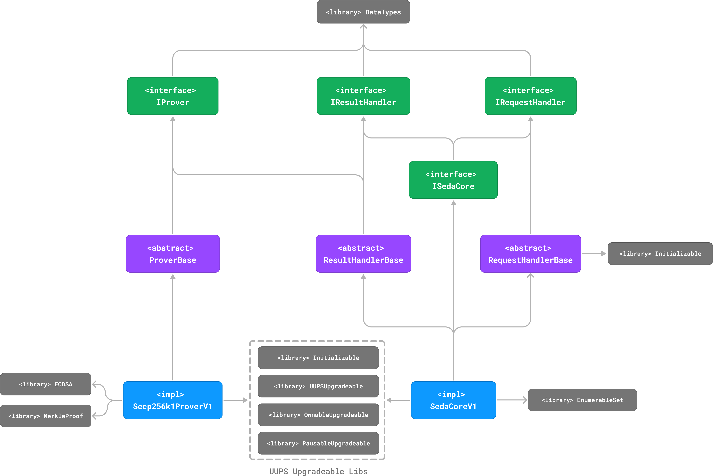

# SEDA EVM Contracts - Architecture Overview

Table of Contents:

1. [Overview](#1-overview)
2. [System Architecture](#2-system-architecture)
   - [2.1 SedaCoreV1](#21-sedacorev1)
   - [2.2 Secp256k1ProverV1](#22-secp256k1proverv1)
   - [2.3 Supporting Components](#23-supporting-components)
3. [Key Mechanisms](#3-key-mechanisms)
   - [3.1 Request-Result Flow](#31-request-result-flow)
   - [3.2 Fee Structure](#32-fee-structure)
   - [3.3 Verification Mechanisms](#33-verification-mechanisms)
4. [Security Considerations](#4-security-considerations)
5. [Limitations & Future Enhancements](#5-limitations--future-enhancements)
6. [Related Documentation](#6-related-documentation)

## 1. Overview

SEDA is a decentralized network that provides programmable oracle infrastructure, enabling secure and reliable access to off-chain data for blockchain applications. The **SEDA EVM Contracts** serve as the destination-chain component of SEDA's cross-chain oracle system, ensuring seamless data integration with blockchain networks.

## 2. System Architecture

The SEDA protocol's EVM implementation revolves around two main smart contracts that handle data requests and verification. These contracts act as a bridge between destination blockchains and the SEDA network. The core functions include:

- **Request Handling & Management**: Processing and tracking data requests.
- **Result Verification & Processing**: Ensuring the authenticity and integrity of data.
- **Validator Set Tracking & Consensus Verification**: Managing validators who sign off on data.
- **Fee Distribution System**: Allocating rewards to participants.

For a more detailed view, refer to the [Detailed Architecture Diagram](diagram-2.png).

### 2.1 SedaCoreV1

`SedaCoreV1` is the primary contract for user interaction, managing the full lifecycle of data requests. It is responsible for:

- Creating and tracking data requests.
- Processing submitted results.
- Collecting and distributing fees.
- Managing request timeouts.
- Maintaining pending requests.

### 2.2 Secp256k1ProverV1

`Secp256k1ProverV1` ensures the validity of results from the SEDA network by verifying validator signatures using the **Elliptic Curve Digital Signature Algorithm (ECDSA)** based on the `secp256k1` curve. Its core responsibilities include:

- Maintaining the active validator set.
- Verifying validator signatures on result batches.
- Validating result inclusion proofs.
- Enforcing sequential batch processing.
- Ensuring consensus threshold requirements are met.

### 2.3 Supporting Components

To enhance modularity and maintainability, several supporting components provide essential functionality:

- **RequestHandlerBase**: Standardizes request handling and tracking.
- **ResultHandlerBase**: Manages the processing and verification of results.
- **ProverBase**: Implements core logic for validator consensus verification.
- **SedaDataTypes**: Defines data structures and utility functions.

These components reduce code duplication and promote a consistent architecture.

## 3. Key Mechanisms

### 3.1 Request-Result Flow

The lifecycle of a data request follows a structured sequence:

1. **Request Submission**
   - User submits request via `SedaCoreV1::postRequest`
   - Request details and fees are stored
   - Request ID is added to pending requests

2. **Off-chain Processing**
   - SEDA network processes the request
   - Results are batched for efficient submission
   - Batches are signed by SEDA chain validators

3. **Batch Submission**
   - Signed batch is submitted via `Secp256k1ProverV1::postBatch`
   - Batch contains results root and validator signatures
   - Requires **66.67%** validator consensus for acceptance

4. **Result Verification**
   - Results submitted via `SedaCoreV1::postResult`
   - `Secp256k1ProverV1::verifyResultProof` validates inclusion
   - Successful verification triggers fee distribution

5. **Request Completion**
   - Request removed from pending state
   - Fees distributed according to rules
   - Events emitted for tracking

### 3.2 Fee Structure

The protocol employs a **three-tier fee model** to incentivize network participants:

1. **Request Fee**
   - Split based on gas usage if a valid payback address is provided
   - Formula: `submitterFee = (gasUsed * requestFee) / gasLimit`
   - Remainder refunded to requester
   - Full refund if no valid payback address

2. **Result Fee**
   - Paid entirely to result submitter (`msg.sender`)
   - Rewards timely result submission

3. **Batch Fee**
   - Paid to batch sender if a valid address is returned by prover
   - Refunded to requester if no valid batch sender

**Additional Features:**

- Fee increases possible via `increaseFees`
- Timeout-based withdrawals for stale requests
- Exact ETH matching required for all fee operations

### 3.3 Verification Mechanisms

SEDA EVM Contracts employ a **two-layer verification** approach to ensure security:

#### Consensus Verification

- Verifies `secp256k1` signatures against the known validator set.
- Ensures sufficient voting power is reached.
- Prevents replay attacks via sequential batch enforcement.

#### Result Inclusion Verification

- Uses **Merkle Tree Proofs** to validate data integrity.
- Ensures submitted results are part of a verified batch.
- Guarantees correctness across different chains.

## 4. Security Considerations

The contracts are designed with **security, upgradability, and efficiency** in mind. Key architectural decisions include:

- **UUPS Proxy Pattern**: Allows controlled contract upgrades.
- **ERC-7201 Compliant Storage Layout**: Ensures storage consistency.
- **Request Timeout Mechanism**: Protects funds from being locked in stale requests.
- **Sequential Batch Processing**: Mitigates replay attacks.
- **Consensus Threshold Alignment**: Maintains consistency with the SEDA network.

## 5. Limitations & Future Enhancements

To ensure correct integration and usage, the following constraints apply:

- **Validator set updates must be sequential** (gaps are supported).
- **Result timestamps must be greater than request timestamps**.
- **Batch heights must increase monotonically**.
- **Request IDs must be unique on each destination chain**.
- **Fee distribution only occurs upon successful result submission**.

## 6. Related Documentation

For additional information and detailed documentation about the SEDA protocol:

- [SEDA Documentation Portal](https://docs.seday.xyz) - Complete protocol documentation and guides